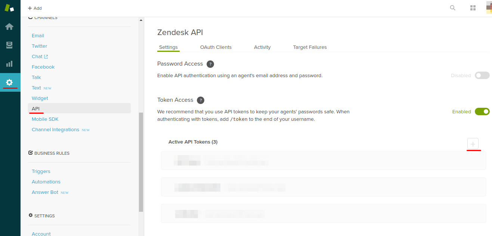
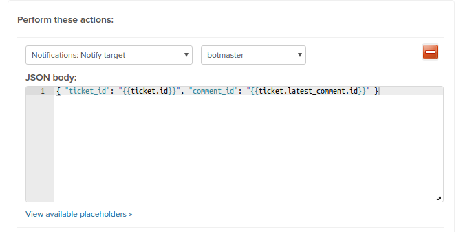

# Botmaster-Zendesk

This is the Zendesk integration for Botmaster. It allows you to automate support for tickets on Zendesk.

### This package works with Botmaster v3;
Botmaster is a lightweight chatbot framework. Its purpose is to integrate your existing chatbot into a variety of messaging channels.

### Documentation
Find the whole documentation for the framework on: [botmasterai.com/documentation/latest/](botmasterai.com/documentation/latest/)

### Installing
`yarn add @wearerobos/botmaster-zendesk`

or

`npm install --save @wearerobos/botmaster-zendesk`

### Credentials and Webhook
You will need to pass 3 credentials when you use the plugin: **subdomain**, **email** and **token**. You will also need to specify a **webhookEndpoint**, that is the URL to which Zendesk will send updates.

The _subdomain_ is basically the prefix of your zendesk URL. For example, if your url is mycompany.zendesk.com your subdomain is _mycompany_.

The _email_ is the e-mail of the account that will answer the tickets.

The _token_ is given to you by Zendesk. Go to `Settings -> Api` and create a new API token.



You will pass the generated token to the plugin. _Remember to copy and store the token._

You will need to configure two other things.

Go to `Extensions -> add target -> HTTP target`. The Url will be `[your_server_url]/zendesk/[webhookEndpoint]`. Configure the method as _POST_ and the Content Type as _JSON_.

Now go to `Settings -> Triggers -> Add trigger`. The first condition is _Ticket: Received at_. The next conditions can be configured as you wish, and in the _actions_ you configure it like this:



The second list will show you the target that created in the last step. Choose it.

The JSON body _must_ be this:
`{ "ticket_id": "{{ticket.id}}", "comment_id": "{{ticket.latest_comment.id}}" }`.
Since Zendesk doesn't send all the tickets data via webhook, Botmaster needs to fetch it after receiving the *ticket_id* and the *last_comment_id*.

### Code

```javascript
const Botmaster = require('botmaster');
const ZendeskBot = require('botmaster-zendesk');

// the default port will be used, but you can pass { port: [your_port] } if you wish
const botmaster = new Botmaster();

const zendeskSettings = {
  credentials: {
    subdomain: 'your_subdomain',
    email: 'email@domain.com',
    token: 'token',
  },
  // botmaster will mount the URL as [your_server_url]/zendesk/webhook1234
  webhookEndpoint: 'webhook1234',
};

botmaster.addBot(new ZendeskBot(zendeskSettings));

botmaster.use({
  type: 'incoming',
  name: 'whatever-you-want',
  controller(bot, update) {
    bot.reply(update, 'Heyllo!');
  },
});
```

### License
This library is licensed under the MIT [license](LICENSE)
